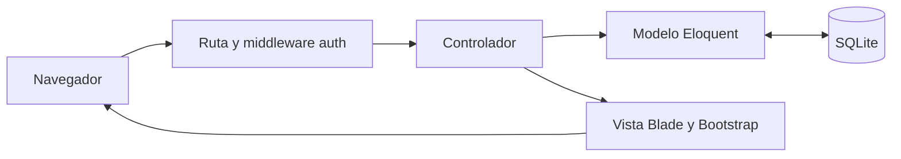

# Ingeniería Web — Inventario con CRUD y Login

Aplicación académica para gestionar un inventario de productos. Implementa el patrón **MVC** con **Laravel 13**, vistas **Blade**, **Bootstrap 5.3.8** y una base de datos **SQLite**. El usuario inicia sesión con nombre de usuario y contraseña; todas las operaciones CRUD requieren autenticación.

## Funcionalidades

- Login con usuario y contraseña, mensajes de error y límite de intentos.
- Logout con invalidación de sesión.
- Rutas protegidas por el middleware `auth`, incluso al ingresar una URL directamente.
- Crear, listar, consultar, editar y eliminar productos.
- Búsqueda por nombre o SKU y paginación.
- Confirmación antes de eliminar y avisos de operaciones completadas.
- Validación en el servidor: SKU único, precios válidos y existencias enteras no negativas.
- Contraseñas almacenadas mediante **bcrypt**, nunca como texto plano.
- Formularios con token CSRF y salida escapada de Blade.
- Bootstrap incluido localmente: la interfaz funciona sin CDN ni internet después de instalar.
- Migraciones, datos de demostración y pruebas automatizadas.

El inventario es compartido por los usuarios autenticados. Esta actividad no incluye registro público, roles ni recuperación de contraseña.

## Inicio rápido en este equipo (Windows)

Ya se prepararon PHP, Composer y las dependencias. Abre **iniciar.bat** con doble clic desde esta carpeta.

También puedes abrir PowerShell en la carpeta del proyecto y ejecutar:

```powershell
powershell.exe -NoProfile -ExecutionPolicy Bypass -File .\iniciar.ps1
```

Abre [http://127.0.0.1:8000](http://127.0.0.1:8000).

| Dato | Valor |
| --- | --- |
| Usuario demo | `admin` |
| Contraseña demo | `IngenieriaWeb2026!` |

Son credenciales públicas para una actividad local. Antes de desplegar fuera de tu equipo debes cambiarlas y desactivar `APP_DEBUG`.

### Por qué se ejecuta desde AppData

En este equipo, el acceso controlado a carpetas de Windows impide que PHP escriba en Documentos. El script copia el código a:

```text
%LOCALAPPDATA%\IngenieriaWeb\inventario-mvc
```

La **base de datos activa** es:

```text
%LOCALAPPDATA%\IngenieriaWeb\inventario-mvc\database\database.sqlite
```

El script conserva la base de datos, las sesiones y el archivo `.env` de esa copia. No desactiva la protección de Windows. Los cambios de código se hacen en la carpeta de la entrega; se sincronizan al iniciar el script. La base de datos de la carpeta de entrega es una copia inicial; los nuevos datos se guardan en AppData. Para respaldar los datos, copia el archivo SQLite activo con el servidor detenido.

Detén el servidor con **Ctrl+C**. No ejecutes dos servidores en el mismo puerto.

## Instalación en otro equipo

### Programas necesarios

1. **PHP 8.4** para utilizar las versiones fijadas en `composer.lock`. Extensiones: `ctype`, `curl`, `dom`, `fileinfo`, `filter`, `hash`, `mbstring`, `openssl`, `pdo`, `pdo_sqlite`, `session`, `sqlite3`, `tokenizer`, `xml` y `zip`.
2. **Composer 2** para instalar las dependencias PHP.
3. **Git** para clonar y subir el repositorio.
4. Un navegador. Un editor como VS Code es opcional.

Puedes instalar PHP y Composer con [Laravel Herd para Windows](https://herd.laravel.com/windows), o utilizar [PHP para Windows](https://www.php.net/downloads.php?os=windows) y el [instalador oficial de Composer](https://getcomposer.org/download/). Si PHP pide bibliotecas de Visual C++, utiliza el redistribuible x64 de Microsoft indicado por su documentación.

**No necesitas instalar MySQL, XAMPP, Node.js ni npm para esta aplicación.** SQLite se utiliza mediante las extensiones de PHP. Si el docente exige MySQL, consulta la sección siguiente.

### Pasos de instalación (PowerShell)

Descarga/clona el repositorio y abre su carpeta. En un equipo que permita escribir en esa ubicación:

```powershell
php -v
composer --version
composer install
Copy-Item .env.example .env
php artisan key:generate
New-Item -ItemType File -Path database/database.sqlite
php artisan migrate --seed
php artisan serve --host=127.0.0.1 --port=8000
```

`New-Item` se ejecuta solo cuando el archivo SQLite no existe. No sobrescribas una base de datos existente. Abre [http://127.0.0.1:8000](http://127.0.0.1:8000).

Si Windows bloquea la escritura en Documentos, instala las dependencias en una ubicación de desarrollo permitida o en la carpeta de AppData indicada arriba y utiliza `iniciar.ps1`. La copia de ejecución debe contener `vendor/autoload.php`.

Las dependencias `vendor/`, el archivo `.env`, los logs y las bases de datos no se suben a Git. `composer.lock` sí se incluye para reproducir las mismas versiones.

### Alternativa con MySQL

SQLite satisface la consigna de utilizar base de datos. Para MySQL debes instalar un servidor MySQL y habilitar `pdo_mysql` en PHP. Crea una base vacía llamada `ingenieriaweb` y configura el `.env` activo:

```dotenv
DB_CONNECTION=mysql
DB_HOST=127.0.0.1
DB_PORT=3306
DB_DATABASE=ingenieriaweb
DB_USERNAME=tu_usuario
DB_PASSWORD=tu_password
```

Luego ejecuta `php artisan config:clear` y `php artisan migrate --seed`. Esto crea las tablas en MySQL; no traslada automáticamente los registros de SQLite.

## Patrón MVC

| Capa | Archivos | Responsabilidad |
| --- | --- | --- |
| Modelo | `app/Models/User.php`, `Product.php` | Representan y consultan los registros con Eloquent. |
| Vista | `resources/views/auth/`, `products/`, `layouts/` | Muestran formularios y datos con Blade y Bootstrap. |
| Controlador | `app/Http/Controllers/AuthController.php`, `ProductController.php` | Procesan las solicitudes, llaman al modelo y seleccionan una vista o redirección. |

`routes/web.php` conecta las URLs con los controladores. `ProductRequest` valida los datos antes de guardarlos. `auth` comprueba la sesión antes de permitir el acceso a los controladores del CRUD.



## Base de datos

Las migraciones crean:

- `users`: nombre, username único, email y hash de contraseña.
- `products`: nombre, SKU único, descripción, precio, cantidad y fechas.
- `sessions`: sesiones del login.
- Tablas auxiliares del esqueleto de Laravel para caché y trabajos.

`DatabaseSeeder` crea la cuenta demo y cuatro productos. Usa `firstOrCreate`: ejecutarlo otra vez no duplica registros ni restablece los productos existentes.

## Rutas

| Método | URL | Acción | Requiere sesión |
| --- | --- | --- | --- |
| GET | `/login` | Formulario de login | No |
| POST | `/login` | Validar credenciales | No |
| POST | `/logout` | Cerrar sesión | Sí |
| GET | `/productos` | Listar/buscar | Sí |
| GET | `/productos/create` | Formulario de creación | Sí |
| POST | `/productos` | Guardar producto | Sí |
| GET | `/productos/{id}` | Ver detalle | Sí |
| GET | `/productos/{id}/edit` | Formulario de edición | Sí |
| PUT/PATCH | `/productos/{id}` | Actualizar | Sí |
| DELETE | `/productos/{id}` | Eliminar | Sí |

Sin sesión, las solicitudes del navegador a estas rutas redirigen a `/login`; una solicitud que espera JSON recibe HTTP 401.

## Contraseñas: bcrypt y el requisito del video

La consigna menciona MD5 como ejemplo. Aquí se utiliza **bcrypt**, un hash pensado para contraseñas y soportado por Laravel. Técnicamente es hashing, no cifrado reversible.

El seeder usa `Hash::make(...)`; el login usa `Auth::attempt(...)` para verificar el hash. La contraseña original no se guarda en la tabla `users`.

Para mostrar la evidencia en el video, desde la carpeta activa:

```powershell
php artisan demo:password
```

En este equipo, si PHP no está en PATH:

```powershell
$php = "C:\Users\ASUS\Documents\Ingenieria Web\.tools\php8425\php.exe"
Set-Location "$env:LOCALAPPDATA\IngenieriaWeb\inventario-mvc"
& $php artisan demo:password
```

El comando muestra el hash de la cuenta académica y el algoritmo `bcrypt`. No muestra la contraseña original. También puedes abrir el archivo SQLite activo con un visor y consultar `users.password`.

## Pruebas

En una instalación estándar:

```powershell
php artisan test --compact
```

En este equipo:

```powershell
$php = "C:\Users\ASUS\Documents\Ingenieria Web\.tools\php8425\php.exe"
Set-Location "$env:LOCALAPPDATA\IngenieriaWeb\inventario-mvc"
& $php artisan test --compact
```

Las pruebas utilizan SQLite **en memoria**, separada de los datos de la demostración. Cubren rutas protegidas, login correcto/incorrecto, límite de intentos, logout, hash bcrypt, CRUD, validación, búsqueda y texto escapado. Para revisar las rutas: `php artisan route:list --except-vendor`.

Laravel desactiva la comprobación CSRF durante las pruebas de solicitudes por defecto. La aplicación real mantiene el middleware y todos los formularios incluyen `@csrf`.

## Entrega

1. **Repositorio Git**: el código debe incluir este README y `composer.lock`; evita subir `vendor/`, `.env` o la base de datos.
2. **Video de máximo 3 minutos**: sigue [el guion](docs/VIDEO.md) y publícalo en Loom o YouTube.
3. Añade aquí el enlace del video y el autor antes de entregar.

**Autor:** por completar con tu nombre.  
**Materia:** Ingeniería Web.  
**Enlace del video:** pendiente de grabar y publicar.

El repositorio local está preparado. Para publicarlo, crea un repositorio vacío en tu cuenta de GitHub y ejecuta, reemplazando los marcadores:

```powershell
git remote add origin https://github.com/TU_USUARIO/TU_REPOSITORIO.git
git push -u origin main
```

Nunca ejecutes la URL de ejemplo sin reemplazarla. Necesitarás iniciar sesión en GitHub. El video y la publicación remota son pasos de entrega pendientes.

## Aprender el proyecto

Consulta [la guía paso a paso](docs/APRENDER.md). El recorrido empieza por una petición al listado y sigue por las rutas, el middleware, el controlador, el modelo, la base de datos y la vista.

## Problemas frecuentes

- **php/composer no se reconoce:** instala los programas y abre una terminal nueva; o usa el script portable de este equipo.
- **could not find driver:** habilita `pdo_sqlite` en el `php.ini` que indica `php --ini`.
- **database does not exist:** crea el archivo SQLite y ejecuta las migraciones.
- **no application encryption key:** ejecuta `php artisan key:generate` en la carpeta activa.
- **SQLSTATE / tablas inexistentes:** ejecuta `php artisan migrate --seed` en la carpeta activa.
- **Puerto 8000 ocupado:** detén la instancia anterior o usa otro puerto con `--port=8001`.
- **Errores al escribir logs o vistas en Documentos:** utiliza `iniciar.ps1` y la copia en AppData.
- **La interfaz no muestra cambios:** detén y vuelve a iniciar el script para sincronizar el código; si persiste, ejecuta `php artisan view:clear` en la copia activa.
- **Intentos de login bloqueados:** espera el tiempo indicado, como máximo 60 segundos después del último intento fallido.

## Referencias

- [Documentación Laravel 13](https://laravel.com/docs/13.x)
- [Autenticación de Laravel](https://laravel.com/docs/13.x/authentication)
- [Hashing de Laravel](https://laravel.com/docs/13.x/hashing)
- [Bootstrap 5.3](https://getbootstrap.com/docs/5.3/)
- [Referencia para elaborar el README: Alura](https://www.aluracursos.com/blog/como-escribir-un-readme-increible-en-tu-github)

Bootstrap conserva su licencia MIT en `public/vendor/bootstrap/LICENSE`.
