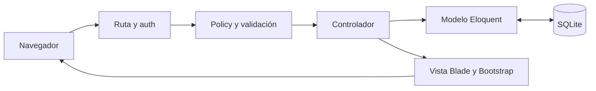

# IngenieriaWebProject · Login y CRUD con MVC

Aplicación académica con **Laravel 13**, **Bootstrap 5.3.8**, **SQLite** y el patrón **MVC**. Permite iniciar sesión con usuario y contraseña para gestionar productos. Cada registro queda vinculado al usuario autenticado y todas las operaciones del CRUD se protegen en el servidor.

> **Requisito del docente:** el login académico usa **MD5** y la base de datos guarda su hash de 32 caracteres. MD5 es un hash, no cifrado reversible, y no es apropiado para contraseñas de usuarios reales. Esta versión de la actividad debe utilizar datos de prueba. El proyecto incluye una configuración con bcrypt para preparar un uso posterior; cambiar el algoritmo requiere crear nuevas credenciales o restablecer las anteriores, no convertir hashes sin conocer la contraseña.

## Contenido

- [Funcionalidades y controles](#funcionalidades-y-controles)
- [Ejecutar en este equipo](#ejecutar-en-este-equipo)
- [Instalación en otro equipo](#instalación-en-otro-equipo)
- [Organización MVC](#organización-mvc)
- [Base de datos](#base-de-datos)
- [Rutas](#rutas)
- [Contraseñas MD5](#contraseñas-md5)
- [Crear otras cuentas](#crear-otras-cuentas)
- [Pruebas y GitHub](#pruebas-y-github)
- [Uso posterior con usuarios reales](#uso-posterior-con-usuarios-reales)
- [Entrega académica](#entrega-académica)

## Funcionalidades y controles

| Control | Comportamiento |
| --- | --- |
| Autenticación | Usuario y contraseña comprobados contra la tabla users. |
| URLs protegidas | auth bloquea todas las rutas de productos, historial y logout sin sesión. |
| Permisos por registro | ProductPolicy impide consultar, editar y eliminar productos de otro usuario, aunque se cambie el ID de la URL. |
| Datos vinculados al login | El servidor asigna user_id desde la sesión; el cliente no puede elegir o cambiar el propietario. |
| Listado privado | Búsquedas, totales y stock bajo se calculan únicamente sobre los productos del usuario actual. |
| Validación en servidor | Nombre y SKU obligatorios, límites de longitud, SKU único, precio no negativo con hasta 2 decimales y stock entero no negativo. |
| Normalización del SKU | Se quitan espacios externos y se convierte a mayúsculas antes de validar. |
| Formularios CSRF | Crear, actualizar, eliminar, login y logout requieren un token válido. |
| Intentos de login | Hasta 5 fallos por usuario/IP y 20 fallos por IP en 60 segundos; cambiar el usuario no evita el límite por IP. |
| Sesión | Regeneración de ID al entrar; invalidación y renovación de token al salir; 30 minutos de inactividad y cookies de sesión. |
| Cookies | HttpOnly y SameSite=Lax; Secure se utiliza en producción con HTTPS. |
| Sesiones en base de datos | El contenido de las sesiones se cifra usando APP_KEY. Esto es distinto del hash de contraseñas MD5. |
| XSS | Blade escapa el texto y CSP limita los scripts al propio sitio. |
| Clickjacking | X-Frame-Options y frame-ancestors impiden incrustar la página en un iframe. |
| Consultas | Eloquent pasa los valores como parámetros; no se concatena la entrada del usuario como código SQL. |
| Campos permitidos | validated() y Fillable limitan los campos que pueden guardarse. |
| Auditoría | Historial de creación, edición y eliminación con usuario, fecha, producto y SKU. |
| Consistencia | La operación y su auditoría se guardan en una transacción: ambas se completan o ninguna se guarda. |
| Repositorio | .env, bases SQLite, dependencias y logs se excluyen de Git. |

El historial es de consulta: no tiene rutas para editar o borrar registros de auditoría. Permanece después de eliminar un producto. Registra la operación y el producto; no es un historial completo de valores anteriores y posteriores.

El sistema no incluye registro público, roles, recuperación de contraseña ni doble factor. El nombre de usuario admin no permite saltarse los permisos por propietario.

## Ejecutar en este equipo

PHP 8.4.25, Composer y las dependencias ya están preparados. Abre **iniciar.bat** con doble clic, o ejecuta:

```powershell
powershell.exe -NoProfile -ExecutionPolicy Bypass -File .\iniciar.ps1
```

Visita [http://127.0.0.1:8000](http://127.0.0.1:8000).

| Credencial de demostración | Valor |
| --- | --- |
| Usuario | admin |
| Contraseña | IngenieriaWeb2026! |

Estas credenciales son públicas para la actividad local. **No utilices contraseñas reales ni datos sensibles en la configuración académica MD5.**

Windows protege la carpeta Documentos frente a la escritura de PHP. El script sincroniza el código a una copia de ejecución en:

```text
%LOCALAPPDATA%\IngenieriaWeb\inventario-mvc
```

La base activa se guarda en:

```text
%LOCALAPPDATA%\IngenieriaWeb\inventario-mvc\database\database.sqlite
```

El script conserva esa base, el archivo .env y las sesiones. No desactiva la protección de Windows. Haz tus cambios de código en la carpeta de la entrega y vuelve a iniciar el script para sincronizarlos. La copia SQLite de la carpeta de entrega es una instantánea inicial; los datos nuevos se guardan en la copia activa.

Detén el servidor con Ctrl+C. Evita iniciar dos servidores simultáneamente. Para respaldar SQLite, copia el archivo activo con el servidor detenido.

## Instalación en otro equipo

Necesitas:

1. **PHP 8.4** para las versiones fijadas en composer.lock.
2. **Composer 2**.
3. **Git** para clonar y publicar el código.
4. Un navegador; VS Code u otro editor es opcional.

Extensiones PHP: ctype, curl, dom, fileinfo, filter, hash, mbstring, openssl, pdo, pdo_sqlite, session, sqlite3, tokenizer, xml y zip.

Opciones oficiales: [Laravel Herd para Windows](https://herd.laravel.com/windows), [PHP para Windows](https://www.php.net/downloads.php?os=windows) e [instalador de Composer](https://getcomposer.org/download/).

**Esta aplicación no necesita MySQL, XAMPP, Node.js ni npm.** SQLite es una base de datos real integrada mediante PHP. Bootstrap está incluido en public/vendor/bootstrap y funciona sin CDN.

En una carpeta de desarrollo donde PHP pueda escribir:

```powershell
php -v
composer --version
composer install
Copy-Item .env.example .env
php artisan key:generate
New-Item -ItemType File -Path database/database.sqlite
php artisan migrate --seed
php artisan serve --host=127.0.0.1 --port=8000
```

Crea el archivo SQLite solo si no existe. No sobrescribas una base con datos. Si Documentos bloquea la escritura, trabaja en una ubicación permitida o prepara la copia de AppData y utiliza iniciar.ps1.

### Alternativa con MySQL

Si el docente exige MySQL, instala un servidor MySQL, habilita pdo_mysql, crea una base vacía y cambia el .env activo:

```dotenv
DB_CONNECTION=mysql
DB_HOST=127.0.0.1
DB_PORT=3306
DB_DATABASE=ingenieriaweb
DB_USERNAME=tu_usuario
DB_PASSWORD=tu_password
```

Ejecuta php artisan config:clear y php artisan migrate --seed. Las migraciones crean las tablas; no transfieren los registros de SQLite a MySQL.

## Organización MVC

```text
app/
├── Console/Commands/CreateUser.php       # Crear cuentas desde terminal
├── Http/Controllers/                    # Auth, productos e historial
├── Http/Middleware/                     # Caché y cabeceras de seguridad
├── Http/Requests/ProductRequest.php     # Validación y permiso de escritura
├── Models/                              # User, Product, ProductAudit
├── Policies/ProductPolicy.php           # Permisos por propietario
├── Providers/AppServiceProvider.php     # Registro de policy y hash MD5
└── Support/Md5Hasher.php                 # Hash MD5 requerido por la actividad
config/                                  # Hashing, sesiones y demostración
database/
├── factories/                           # Datos para pruebas
├── migrations/                          # Estructura reproducible de la BD
└── seeders/                             # Cuenta y productos demo
resources/views/                         # Blade, formularios y errores
public/                                  # CSS, JS y Bootstrap local
routes/web.php                           # URLs y grupos auth/guest
tests/Feature/                           # Pruebas funcionales y de controles
.github/workflows/tests.yml              # Pruebas al publicar en GitHub
docs/                                    # Seguridad, aprendizaje y video
```

| Capa | Responsabilidad |
| --- | --- |
| Modelo | Representa y consulta registros mediante Eloquent. |
| Vista | Genera HTML con Blade y Bootstrap. |
| Controlador | Recibe la solicitud, utiliza los modelos y devuelve vistas o redirecciones. |



## Base de datos

- **users:** usuario único, nombre, email y hash de contraseña.
- **products:** nombre, SKU único global, descripción, precio, stock, propietario user_id y fechas.
- **product_audits:** usuario, ID histórico del producto, operación, nombre, SKU y fechas.
- **sessions:** sesiones del login.
- Tablas auxiliares de caché y trabajos del esqueleto Laravel.

La nueva migración añade la relación con users sin borrar productos. Los registros demo previos se asignan a admin cuando esa cuenta existe. Los registros antiguos sin propietario quedan inaccesibles hasta que se asignen expresamente; la aplicación siempre asigna propietario a los nuevos.

El seeder se ejecuta solo con DEMO_MODE=true. No duplica productos ni restablece sus datos. La cuenta demo original con bcrypt se migra a MD5 únicamente si mantiene la contraseña pública conocida. Otras contraseñas no pueden convertirse a MD5 sin conocer su valor original.

## Rutas

| Método | URL | Acción | Sesión |
| --- | --- | --- | --- |
| GET | /login | Mostrar formulario | No |
| POST | /login | Validar credenciales | No |
| POST | /logout | Cerrar sesión | Sí |
| GET | /productos | Listar y buscar los productos propios | Sí |
| GET | /productos/create | Formulario de creación | Sí |
| POST | /productos | Guardar producto propio | Sí |
| GET | /productos/{id} | Detalle, con permiso por propietario | Sí |
| GET | /productos/{id}/edit | Formulario de edición, con permiso | Sí |
| PUT/PATCH | /productos/{id} | Actualizar, con permiso | Sí |
| DELETE | /productos/{id} | Eliminar, con permiso | Sí |
| GET | /actividad | Historial de la cuenta actual | Sí |

Sin sesión, el navegador se redirige al login; las solicitudes JSON reciben 401. Un usuario autenticado que intenta acceder a un producto ajeno recibe **403**.

## Contraseñas MD5

.env.example contiene HASH_DRIVER=md5 porque el docente lo exige. Laravel utiliza el driver registrado en AppServiceProvider:

- Hash::make calcula MD5 antes de guardar una contraseña.
- Auth::attempt verifica la contraseña usando ese driver.
- hash_equals compara los hashes.
- La columna users.password contiene el hash de 32 caracteres; no el texto original.
- El modelo no vuelve a hashear un hash ya calculado.
- La comparación no vuelve seguro a MD5 frente a ataques fuera de línea.

Para la evidencia del video:

```powershell
php artisan demo:password
```

En este equipo, si PHP no está en PATH:

```powershell
$php = "C:\Users\ASUS\Documents\Ingenieria Web\.tools\php8425\php.exe"
Set-Location "$env:LOCALAPPDATA\IngenieriaWeb\inventario-mvc"
& $php artisan demo:password
```

El comando muestra únicamente el hash de la cuenta académica. Se deshabilita cuando DEMO_MODE=false o en producción.

## Crear otras cuentas

No existe formulario público de registro. Desde la carpeta activa:

```powershell
php artisan users:create alumno
```

Solicita nombre, correo y contraseña mediante entrada oculta. Exige una contraseña confirmada, de al menos 12 caracteres, con mayúsculas, minúsculas, números y símbolos, y un máximo de 72 bytes. Valida usuario y correo únicos. En modo académico guarda MD5; con HASH_DRIVER=bcrypt guarda bcrypt.

Cada cuenta nueva empieza con su propio inventario vacío. Una cuenta no puede gestionar registros de otra.

## Pruebas y GitHub

```powershell
php artisan test --compact
```

En este equipo, usa la ruta portable de PHP y la carpeta activa como en el ejemplo del hash. Las pruebas usan SQLite en memoria y no borran los datos de la aplicación.

La validación local pasó **45 pruebas y 195 comprobaciones**, más el flujo HTTP real con CSRF y auditoría. Se comprueban login, logout, rutas protegidas, MD5, bcrypt opcional, acceso entre usuarios, propietario fijado por el servidor, validación, búsqueda privada, auditoría, transacciones, límites de intentos y cabeceras de seguridad.

Laravel desactiva CSRF durante sus pruebas de solicitudes por defecto; la comprobación HTTP real también verifica que un formulario sin token recibe 419.

El workflow tests.yml instala las dependencias y ejecuta las pruebas con PHP 8.4 en GitHub Actions. La primera ejecución publicada [terminó correctamente](https://github.com/iDavidDLT/IngenieriaWebProject/actions/runs/37713575358).

El repositorio está publicado en iDavidDLT/IngenieriaWebProject. Para vincular una copia local que aún no tiene origin:

```powershell
git remote add origin https://github.com/iDavidDLT/IngenieriaWebProject.git
git push -u origin main
```

En una copia que ya tiene origin configurado, utiliza solo git push. No subas .env, bases SQLite, vendor ni logs. Sí se incluyen composer.lock, migraciones, pruebas y documentación.

## Uso posterior con usuarios reales

**La configuración académica MD5 no está lista para guardar contraseñas reales.** Para preparar otro entorno:

1. Utiliza HTTPS y un servidor web que exponga únicamente la carpeta public.
2. Usa .env.production.example como referencia y completa APP_KEY y la conexión de base de datos.
3. Mantén HASH_DRIVER=bcrypt, DEMO_MODE=false y APP_DEBUG=false.
4. Crea cuentas privadas con users:create. Las cuentas antiguas MD5 necesitan contraseñas nuevas; cambiar la variable por sí solo no las convierte.
5. Configura backups, permisos de escritura y la administración de cuentas según el uso previsto.

La aplicación rechaza arrancar con APP_ENV=production si MD5 o la demo están habilitados. En producción también fuerza Secure y HttpOnly para la cookie de sesión. Esto ayuda a evitar una configuración incorrecta; no reemplaza una revisión completa del despliegue.

## Entrega académica

- **Materia:** Ingeniería Web.
- **Autor en GitHub:** iDavidDLT; completa tu nombre para la entrega académica.
- **Repositorio GitHub:** [iDavidDLT/IngenieriaWebProject](https://github.com/iDavidDLT/IngenieriaWebProject).
- **Video Loom/YouTube:** pendiente de grabar y publicar.

Sigue [el guion de máximo 3 minutos](docs/VIDEO.md). Consulta [las protecciones explicadas](docs/SEGURIDAD.md) y [la guía paso a paso](docs/APRENDER.md).

## Problemas frecuentes

- php/composer no se reconoce: instala PHP/Composer y abre una terminal nueva, o usa el iniciador portable.
- could not find driver: habilita pdo_sqlite en el archivo indicado por php --ini.
- Tablas inexistentes: ejecuta php artisan migrate --seed en la copia activa.
- APP_KEY vacía: ejecuta php artisan key:generate.
- Sesión/token caducado: vuelve al login y envía el formulario de nuevo.
- 403 en un producto: la cuenta actual no es su propietaria.
- Demasiados intentos: espera el tiempo indicado, hasta 60 segundos desde el último fallo.
- Puerto ocupado: detén el servidor previo o utiliza otro puerto.
- Cambios no visibles: reinicia el iniciador para sincronizar y, si hace falta, ejecuta php artisan view:clear.

## Referencias

- [Laravel: autenticación](https://laravel.com/docs/13.x/authentication)
- [Laravel: autorización y policies](https://laravel.com/docs/13.x/authorization)
- [Laravel: hashing](https://laravel.com/docs/13.x/hashing)
- [OWASP: almacenamiento de contraseñas](https://cheatsheetseries.owasp.org/cheatsheets/Password_Storage_Cheat_Sheet.html)
- [Bootstrap 5.3](https://getbootstrap.com/docs/5.3/)
- [Alura: elaboración del README](https://www.aluracursos.com/blog/como-escribir-un-readme-increible-en-tu-github)

Bootstrap conserva su licencia MIT en public/vendor/bootstrap/LICENSE.
